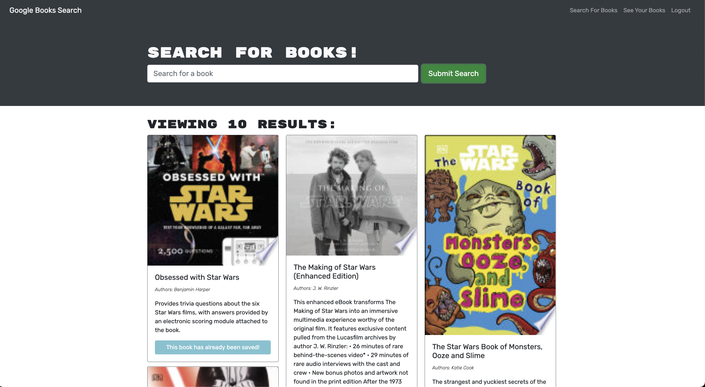
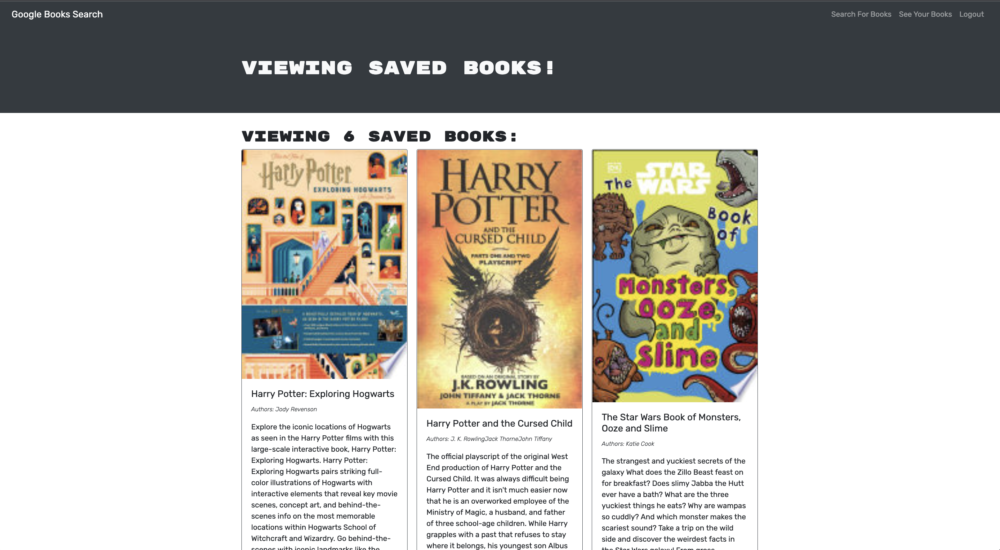

# GraphQL Booksearch Engine

## Description
This a search engine that uses the google api to search for different books that as a user, one might be intested in. Users can log in and then be able save boooks they want to read and then delete these books from their saved list whenever they need to. The application is also powered by the graphql api. To use this application please visit https://thawing-ocean-78972.herokuapp.com/ and create an account today!

## Built With
 * Apollo
 * BootStrap
 * Bcrypt
 * Express
 * GraphQL
 * JavaScript
 * JSON Web Tokens
 * MongoDB
 * Mongoose
 * Node
 * React
 * React Router

## ScreenShot

## Usage
To use the book search enigne, start by simply typing the name of book into the search engine and then clicking submit search. As a non logged in user you will be able to see all books related to the search query. To be able to save books that you find through your search, please login or sign up and then enter the name of the book you would like to look up in the search bar. Upon receiving results you will now be able to save individual books. These saved books can be located in the saved books sections where you can delete a saved book if you no longer wish tohave it saved. 

## License
This application is covered under the MIT.
For more details about licensing, use this link: https://choosealicense.com/licenses/mit/.

## Questions
For additional information about the project, please find it at the following www.github.com/omcewan.
Also if you have additional questions please contact me at orlandomcewan231@gmail.com.
